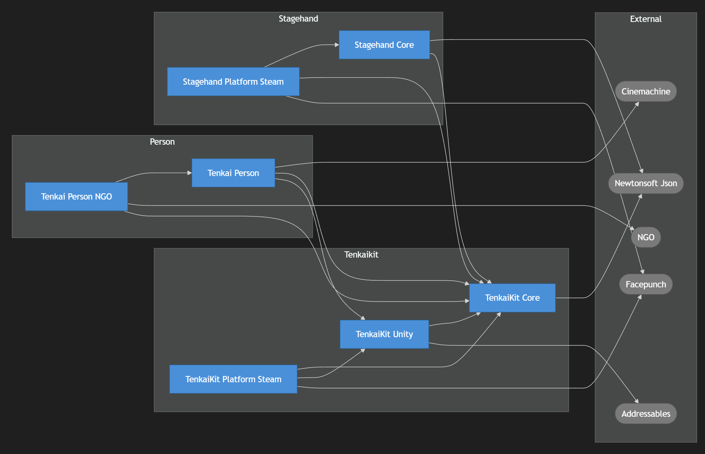

# upm-dep-graph

Unity UPM パッケージの依存関係を Mermaid グラフ + 詳細テーブルの Markdown として出力するツール。

出力例：


## 概要

複数の UPM パッケージディレクトリを走査し、各 `package.json` から依存情報を収集して Markdown ファイルを生成する。

- **自作パッケージ** は青いノード（四角）で表示
- **外部パッケージ** (UPM / サードパーティ) はグレーのノード（角丸）で表示

## 必要環境

- Python 3.10 以上
- [PyYAML](https://pypi.org/project/PyYAML/)

```bash
pip install pyyaml
```

## ファイル構成

```
_upm-dep-graph/
├── config.yaml                 # パッケージルート・外部パッケージ設定
├── run.bat                     # Windows 実行スクリプト
├── src/
│   └── generate.py  # メインスクリプト
└── output/
    └── out_dependency.md       # 生成された依存関係ドキュメント
```

## 使い方

### Windows (run.bat)

```bat
run.bat
```

### コマンドライン

```bash
python src/generate.py --config config.yaml --output output/out_dependency.md
```

| オプション | デフォルト      | 説明               |
| ---------- | --------------- | ------------------ |
| `--config` | `config.yaml`   | 設定ファイルのパス |
| `--output` | `dependency.md` | 出力ファイルのパス |

## config.yaml の設定

```yaml
# 自作パッケージ一覧
packages:
  - root: D:/path/to/unity_packages
    dirs:
      - ProjectA/Packages/com.example.package-a
      - ProjectB/Packages/com.example.package-b

# 外部パッケージの表示名カスタマイズ（省略可）
external:
  com.unity.netcode.gameobjects:
    display: "Netcode for GameObjects"

# 依存ルールメモ（省略可）
rules:
  - Core パッケージは外部依存を最小限にする
```

### packages セクション

`root` 以下の `dirs` に列挙したディレクトリから `package.json` を検索する。`package.json` が見つからない場合は警告を出してスキップする。

### external セクション

外部パッケージの `display` 名を指定しない場合、パッケージ ID の末尾セグメントからタイトルケースで自動生成される（例: `com.unity.cinemachine` → `Cinemachine`）。

## 出力

生成される Markdown には以下が含まれる。

1. **Mermaid 依存グラフ** — パッケージ間の依存関係を有向グラフで可視化
2. **パッケージ詳細テーブル** — 各パッケージのバージョン・依存・被依存を一覧化
